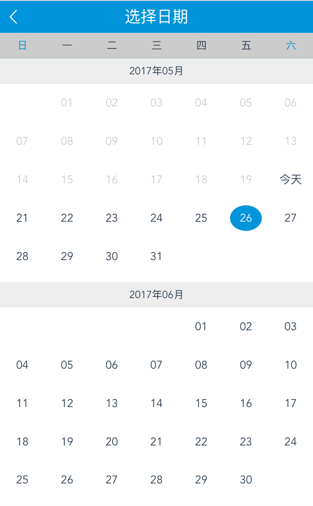
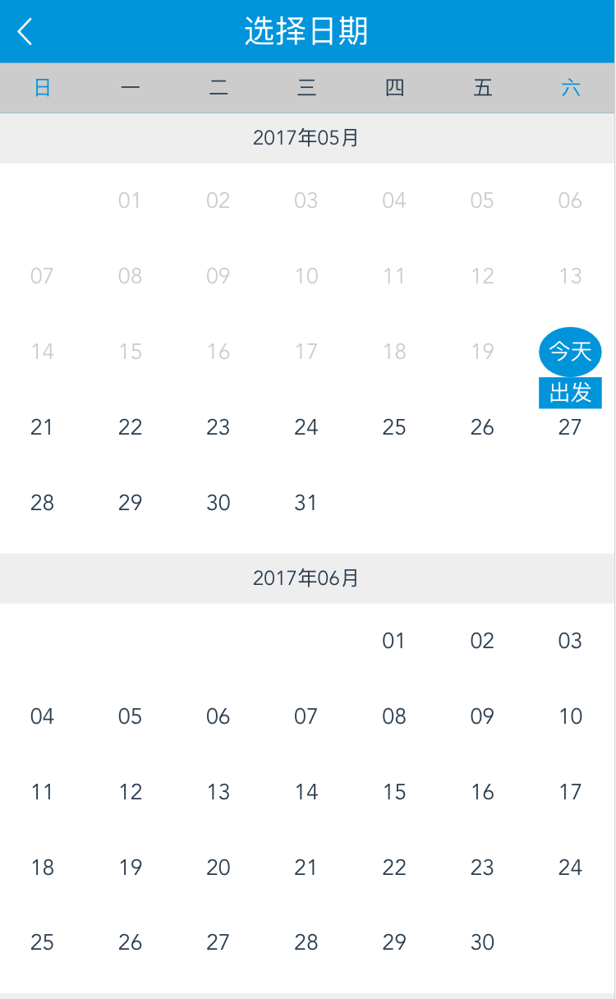

# datePicker-vue

> A Vue.js 2.0  时间选择 project

首先
npm install datepicker-vue --save-dev

使用方法：
//<template> 
  
 
    
 
      <input type="text" readonly v-model="dateTime" placeholder="请选择时间" style="font-size: 40px"/> 
    
 
    <date @dateClick="dateClick" @dateBack="dateBack" v-show="dateShow" :max="max" :openTime="openTime" :min="min"></date> 
  
 

 

//可选择绑定属性 
tipDivText  //就是文字提示信息，默认为空。 可以为'出发啊，等文字提示信息' 
min         //最小时间。默认今天 
max         //最大时间。默认2019-05-20 
openTime    //传给时间插件展示的选中时间。默认今天。 

